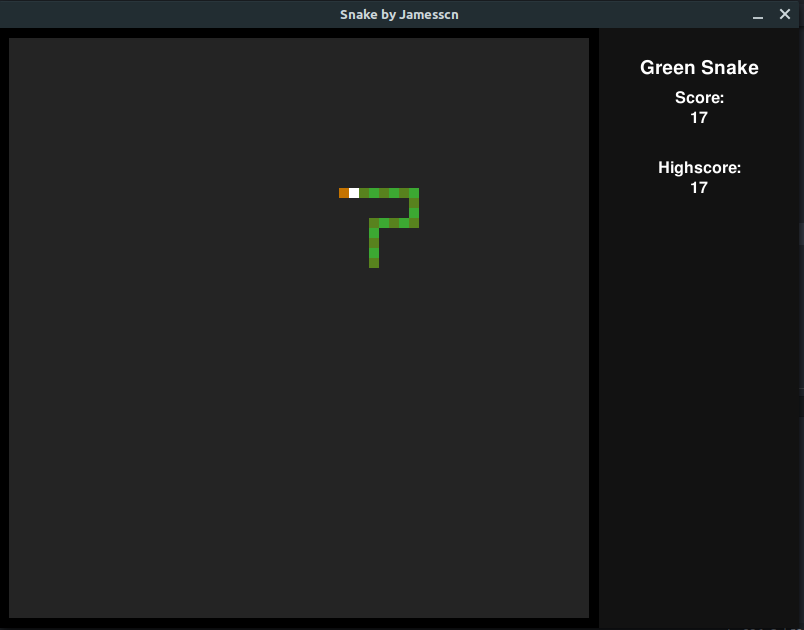

# Snake

The game snake remade with the help of Python 3 and pygame.

**Features**

* One or two player mode
* Highscores
* Music and sound effects
* Functional menu

**Controls**

Use WASD to control the green snake (player one), and the arrow keys to control the red snake (player two). The menu can be navigated with the arrow keys or the mouse, and the P key pauses or unpauses the game.